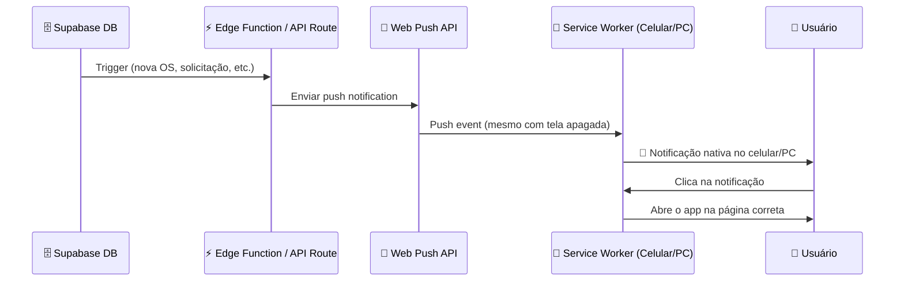

# 📱 Plano de Ação: PWA + Push Notifications

## Diagnóstico Atual

| Funcionalidade | Status | Detalhes |
|---|---|---|
| Notificações in-app (dentro do site) | ✅ Funciona | `NotificationCenter.tsx` usa Supabase Realtime |
| Funciona em tempo real? | ⚠️ Parcialmente | Só enquanto a aba está aberta no navegador |
| Funciona com tela apagada? | ❌ Não | Sem Service Worker / Web Push |
| Ícone no celular? | ❌ Não | Sem `manifest.json` (não é PWA) |
| Ícone no PC? | ❌ Não | Sem `manifest.json` (não é PWA) |

**Resumo**: As notificações APENAS funcionam quando o usuário está com o site aberto. Ao fechar a aba ou desligar a tela, NADA é recebido.

---

## Arquitetura Alvo



---

## Fase 1: PWA (Ícone no Celular e PC)

### 1.1 Criar `public/manifest.json`
```json
{
  "name": "SmartOS - Gestão Inteligente",
  "short_name": "SmartOS",
  "description": "ERP para assistências técnicas",
  "start_url": "/dashboard",
  "display": "standalone",
  "background_color": "#0f172a",
  "theme_color": "#6366f1",
  "orientation": "any",
  "icons": [
    { "src": "/icons/icon-192.png", "sizes": "192x192", "type": "image/png" },
    { "src": "/icons/icon-512.png", "sizes": "512x512", "type": "image/png" },
    { "src": "/icons/icon-maskable-512.png", "sizes": "512x512", "type": "image/png", "purpose": "maskable" }
  ]
}
```

### 1.2 Criar ícones do app
- Gerar 3 PNGs: `icon-192.png`, `icon-512.png`, `icon-maskable-512.png`
- Salvar em `public/icons/`
- **Dica**: Use https://maskable.app/editor para criar o ícone maskable

### 1.3 Registrar o manifest no `src/app/layout.tsx`
```tsx
// Dentro do <head> ou via metadata
export const metadata: Metadata = {
  // ... metadata existente ...
  manifest: "/manifest.json",
  themeColor: "#6366f1",
  appleWebApp: {
    capable: true,
    statusBarStyle: "black-translucent",
    title: "SmartOS"
  }
};
```

### 1.4 Adicionar meta tags para iOS
No `layout.tsx`, adicionar dentro do `<head>`:
```html
<link rel="apple-touch-icon" href="/icons/icon-192.png" />
<meta name="apple-mobile-web-app-capable" content="yes" />
```

### 1.5 Criar Service Worker básico (`public/sw.js`)
```js
const CACHE_NAME = 'smartos-v1';

self.addEventListener('install', (event) => {
  self.skipWaiting();
});

self.addEventListener('activate', (event) => {
  event.waitUntil(clients.claim());
});

// Cache básico para offline (opcional mas recomendado)
self.addEventListener('fetch', (event) => {
  // Pass-through por enquanto, apenas para ativar o PWA
  event.respondWith(fetch(event.request));
});
```

### 1.6 Registrar o Service Worker
Criar `src/lib/registerSW.ts`:
```ts
export function registerServiceWorker() {
  if (typeof window !== 'undefined' && 'serviceWorker' in navigator) {
    window.addEventListener('load', () => {
      navigator.serviceWorker.register('/sw.js')
        .then(reg => console.log('[SW] Registered:', reg.scope))
        .catch(err => console.error('[SW] Registration failed:', err));
    });
  }
}
```

Chamar em `src/app/layout.tsx` ou no `AuthProvider`:
```tsx
useEffect(() => { registerServiceWorker(); }, []);
```

**Resultado da Fase 1**: O usuário poderá "Instalar" o app no celular e PC, com ícone na tela inicial.

---

## Fase 2: Push Notifications (Tela Apagada)

### 2.1 Gerar chaves VAPID
```bash
npx web-push generate-vapid-keys
```
Salvar as chaves no `.env.local`:
```
NEXT_PUBLIC_VAPID_PUBLIC_KEY=BPxxxxx...
VAPID_PRIVATE_KEY=xxxxx...
VAPID_SUBJECT=mailto:admin@smartos.com.br
```

### 2.2 Instalar `web-push`
```bash
npm install web-push
```

### 2.3 Criar tabela `push_subscriptions` no Supabase
```sql
CREATE TABLE push_subscriptions (
  id UUID DEFAULT gen_random_uuid() PRIMARY KEY,
  usuario_id UUID REFERENCES usuarios(id) ON DELETE CASCADE,
  empresa_id UUID REFERENCES empresas(id) ON DELETE CASCADE,
  endpoint TEXT NOT NULL,
  keys JSONB NOT NULL,       -- { p256dh, auth }
  created_at TIMESTAMPTZ DEFAULT now(),
  UNIQUE(usuario_id, endpoint)
);

ALTER TABLE push_subscriptions ENABLE ROW LEVEL SECURITY;

CREATE POLICY "Usuário gerencia suas subscriptions"
  ON push_subscriptions FOR ALL
  USING (usuario_id IN (
    SELECT id FROM usuarios WHERE auth_user_id = auth.uid()
  ));
```

### 2.4 Frontend: Pedir permissão e salvar subscription
Criar `src/lib/pushNotifications.ts`:
```ts
export async function subscribeToPush(usuarioId: string, empresaId: string) {
  if (!('Notification' in window) || !('serviceWorker' in navigator)) return null;

  const permission = await Notification.requestPermission();
  if (permission !== 'granted') return null;

  const reg = await navigator.serviceWorker.ready;
  const subscription = await reg.pushManager.subscribe({
    userAcquireCredentials: true,
    applicationServerKey: urlBase64ToUint8Array(process.env.NEXT_PUBLIC_VAPID_PUBLIC_KEY!)
  });

  // Salvar no Supabase
  const supabase = createClient();
  await supabase.from('push_subscriptions').upsert({
    usuario_id: usuarioId,
    empresa_id: empresaId,
    endpoint: subscription.endpoint,
    keys: {
      p256dh: arrayBufferToBase64(subscription.getKey('p256dh')!),
      auth: arrayBufferToBase64(subscription.getKey('auth')!)
    }
  }, { onConflict: 'usuario_id,endpoint' });

  return subscription;
}

function urlBase64ToUint8Array(base64String: string) {
  const padding = '='.repeat((4 - base64String.length % 4) % 4);
  const base64 = (base64String + padding).replace(/-/g, '+').replace(/_/g, '/');
  const rawData = window.atob(base64);
  return Uint8Array.from([...rawData].map(c => c.charCodeAt(0)));
}

function arrayBufferToBase64(buffer: ArrayBuffer) {
  return btoa(String.fromCharCode(...new Uint8Array(buffer)));
}
```

### 2.5 Chamar `subscribeToPush` no login/dashboard
No `AuthContext.tsx` ou no `DashboardLayout`, após confirmar o profile:
```ts
useEffect(() => {
  if (profile && empresa) {
    subscribeToPush(profile.id, empresa.id);
  }
}, [profile, empresa]);
```

### 2.6 Backend: API para enviar push
Criar `src/app/api/push/send/route.ts`:
```ts
import webpush from 'web-push';
import { getSupabaseAdmin } from '@/lib/supabase/admin';

webpush.setVapidDetails(
  process.env.VAPID_SUBJECT!,
  process.env.NEXT_PUBLIC_VAPID_PUBLIC_KEY!,
  process.env.VAPID_PRIVATE_KEY!
);

export async function POST(req: Request) {
  const { usuario_ids, titulo, corpo, url } = await req.json();
  const supabase = getSupabaseAdmin();

  const { data: subs } = await supabase
    .from('push_subscriptions')
    .select('*')
    .in('usuario_id', usuario_ids);

  const results = await Promise.allSettled(
    (subs || []).map(sub =>
      webpush.sendNotification(
        { endpoint: sub.endpoint, keys: sub.keys },
        JSON.stringify({ titulo, corpo, url })
      )
    )
  );

  return Response.json({ sent: results.length });
}
```

### 2.7 Service Worker: Receber push e mostrar notificação
Adicionar ao `public/sw.js`:
```js
self.addEventListener('push', (event) => {
  const data = event.data?.json() || {};
  event.waitUntil(
    self.registration.showNotification(data.titulo || 'SmartOS', {
      body: data.corpo || 'Nova notificação',
      icon: '/icons/icon-192.png',
      badge: '/icons/icon-192.png',
      data: { url: data.url || '/dashboard' },
      vibrate: [200, 100, 200]
    })
  );
});

self.addEventListener('notificationclick', (event) => {
  event.notification.close();
  const url = event.notification.data?.url || '/dashboard';
  event.waitUntil(
    clients.matchAll({ type: 'window' }).then(windowClients => {
      for (const client of windowClients) {
        if (client.url.includes(url) && 'focus' in client) return client.focus();
      }
      return clients.openWindow(url);
    })
  );
});
```

**Resultado da Fase 2**: Notificações push NATIVAS — aparecem mesmo com a tela do celular apagada, com vibração e som.

---

## Fase 3: Disparar Push em Eventos Importantes

### 3.1 Integrar com o `NotificationCenter.tsx` existente
Quando uma `solicitacao` é criada no Supabase, disparar push automaticamente.

**Opção A: Supabase Database Webhook** (recomendado)
Criar um webhook no painel do Supabase que chama `/api/push/send` quando há INSERT na tabela `solicitacoes`.

**Opção B: Supabase Edge Function**
```sql
-- Trigger que chama a Edge Function
CREATE OR REPLACE FUNCTION notify_push_on_solicitacao()
RETURNS TRIGGER AS $$
BEGIN
  PERFORM net.http_post(
    url := 'https://seu-app.vercel.app/api/push/send',
    body := json_build_object(
      'usuario_ids', ARRAY[NEW.atribuido_a],
      'titulo', NEW.titulo,
      'corpo', NEW.descricao,
      'url', '/dashboard'
    )::text,
    headers := '{"Content-Type": "application/json"}'::jsonb
  );
  RETURN NEW;
END;
$$ LANGUAGE plpgsql;

CREATE TRIGGER trigger_push_solicitacao
AFTER INSERT ON solicitacoes
FOR EACH ROW EXECUTE FUNCTION notify_push_on_solicitacao();
```

### 3.2 Eventos que devem disparar push
| Evento | Destinatário | Prioridade |
|---|---|---|
| Nova OS criada | Admin + Técnico atribuído | Alta |
| OS mudou de status | Cliente (se tiver conta) | Média |
| Solicitação urgente | Admin | Urgente |
| Estoque abaixo do mínimo | Admin | Alta |
| Nova venda concluída | Admin | Baixa |

---

## Checklist de Execução

```
[ ] Fase 1: PWA
    [ ] 1.1 Criar public/manifest.json
    [ ] 1.2 Gerar ícones (192, 512, maskable)
    [ ] 1.3 Adicionar manifest ao layout.tsx metadata
    [ ] 1.4 Adicionar meta tags Apple
    [ ] 1.5 Criar public/sw.js (básico)
    [ ] 1.6 Criar src/lib/registerSW.ts e chamar no layout

[ ] Fase 2: Push Notifications
    [ ] 2.1 Gerar chaves VAPID
    [ ] 2.2 npm install web-push
    [ ] 2.3 Criar tabela push_subscriptions no Supabase
    [ ] 2.4 Criar src/lib/pushNotifications.ts
    [ ] 2.5 Integrar subscribeToPush no AuthContext/Dashboard
    [ ] 2.6 Criar src/app/api/push/send/route.ts
    [ ] 2.7 Adicionar push handler ao sw.js

[ ] Fase 3: Triggers
    [ ] 3.1 Webhook ou Edge Function para solicitações
    [ ] 3.2 Configurar eventos prioritários
```

---

## Dependências

| Pacote | Motivo |
|---|---|
| `web-push` | Enviar push notifications do servidor |

## Variáveis de Ambiente Novas

| Variável | Descrição |
|---|---|
| `NEXT_PUBLIC_VAPID_PUBLIC_KEY` | Chave pública VAPID (frontend) |
| `VAPID_PRIVATE_KEY` | Chave privada VAPID (backend) |
| `VAPID_SUBJECT` | Email do administrador |
